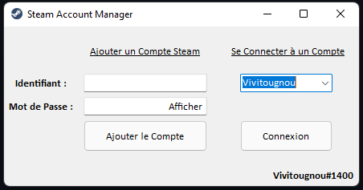

# Steam Manager
Vous possédez plusieurs comptes Steam ? Voici la solution :

 

### Vous avez un disque nommé D et vous voulez tester le logiciel ? [Download Setup.exe](https://github.com/Vivitougnou/steam-manager/blob/main/Steam%20Account%20Manager.exe)

# Divers :

Vous pouvez ajouter directement via le logiciel votre compte qui sera stocké dans un fichier .txt en local sur votre ordinateur à un répértoire choisi.

Vous pouvez ensuite choisir un de vos compte et vous connecter en un seul clic ! (via vos Registry Value)

            startInfo.FileName = (string)Registry.GetValue(@"HKEY_CURRENT_USER\SOFTWARE\Valve\Steam", "SteamExe", "null");
            
            

__Si vous n'avez pas de disque nommé D, modifier la lettre D:\ du path en incluant un disque disponible (merci d'éviter le C:\)__

        string path = @"D:\data.txt";
       
*Exemple :*

        string path = @"F:\data.txt";
